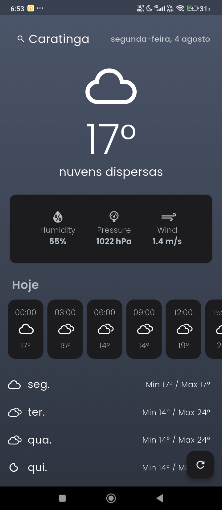
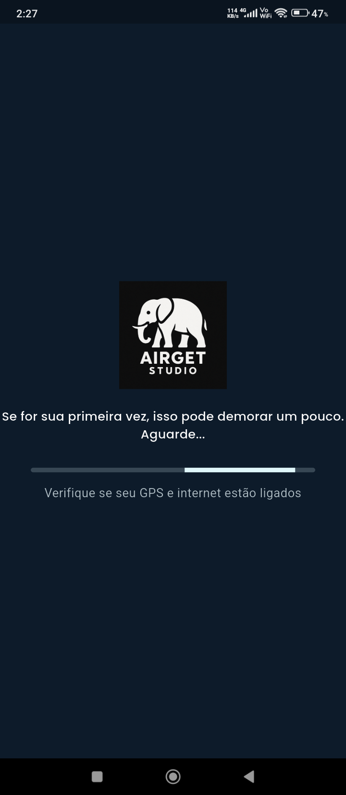
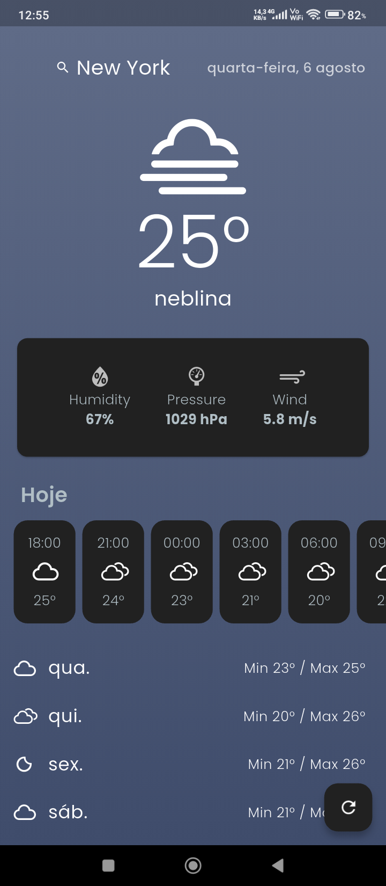
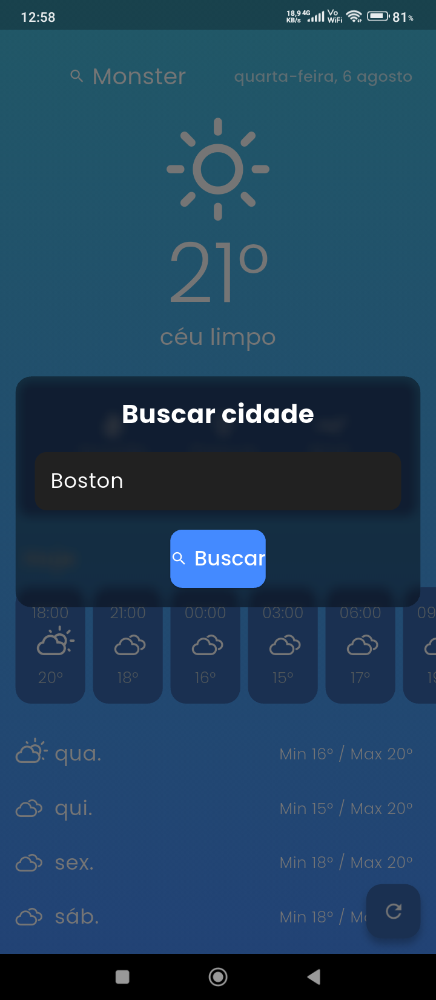

# 🌤️ Weather App 🇧🇷 

Aplicativo de previsão do tempo moderno, intuitivo e responsivo, desenvolvido com Flutter. Detecta automaticamente a localização do usuário (com permissão) e exibe dados climáticos em tempo real, incluindo previsão por hora e semanal. Também funciona offline, utilizando dados armazenados localmente.

---

## 📸 Demonstração Visual

| Tela Inicial | Carregamento | Previsão Semanal | Busca por Cidade |
|--------------|-------------------|------------------|------------------|
|  |  |  |  |

---

## 📱 Funcionalidades

- 📍 Detecção automática da cidade via GPS
- 🔍 Busca manual por cidade com validação
- 🌡️ Exibição do clima atual com ícone animado e temperatura
- 📊 Detalhes como umidade, pressão e velocidade do vento
- ⏱️ Previsão por hora com ícones e temperatura
- 📅 Previsão semanal com ícones e temperaturas mín/max
- 📦 Modo offline com cache local
- 🎨 Interface com gradientes dinâmicos e animações suaves
- 🧊 Tela de busca com efeito de desfoque (glassmorphism)
- 💬 Frases curiosas e dicas durante o carregamento
- ⏳ Timeout com alerta de conexão após 40 segundos
- ❌ Tela de erro com botão de “Tentar novamente”

---

## 🛠️ Tecnologias Utilizadas

| Tecnologia           | Finalidade                            |
|----------------------|----------------------------------------|
| Flutter              | Framework principal                    |
| GetX                 | Gerenciamento de estado e rotas        |
| GetStorage           | Armazenamento local                    |
| Geolocator           | Acesso à localização do dispositivo    |
| Geocoding            | Conversão de coordenadas em cidade     |
| Dio                  | Requisições HTTP                       |
| Intl                 | Formatação de datas                    |
| Google Fonts         | Tipografia personalizada               |
| Weather Icons        | Ícones temáticos para clima            |
| Mocktail / Mockito   | Mocks para testes unitários            |
| Integration Test     | Testes de integração                   |

---

## 🧪 Testes Automatizados

- ✅ Testes unitários com `flutter_test`, `mocktail`, `mockito`
- 🧪 Testes de integração com `integration_test`
- 📊 Cobertura de código com `flutter test --coverage`

---

## 🚀 Como Gerar o APK

1. Certifique-se de que o Flutter está instalado e configurado.
2. No terminal, execute:

```bash
flutter build apk --release
```
- O APK será gerado em:
build/app/outputs/flutter-apk/app-release.apk

Você pode instalar esse APK diretamente em dispositivos Android.
👨‍💻 Autor
Desenvolvido por Emanoel da S. Gomes
📸 Créditos visuais: icons8


---

# 🌤️ Weather App 🇱🇷

A modern, intuitive, and responsive **weather forecast app** built with Flutter.  
It automatically detects the user’s location (with permission) and displays real-time weather data, including **hourly and weekly forecasts**.  
Also works offline by using locally cached data.

---

## 📸 Visual Demo

| Home Screen | Loading | Weekly Forecast | City Search |
|-------------|----------|-----------------|-------------|
|  |  |  |  |

---

## 📱 Features

- 📍 Automatic city detection via GPS  
- 🔍 Manual city search with validation  
- 🌡️ Current weather with animated icon & temperature  
- 📊 Extra details: humidity, pressure, wind speed  
- ⏱️ Hourly forecast with icons & temperature  
- 📅 Weekly forecast with min/max temperatures  
- 📦 Offline mode with local cache  
- 🎨 Dynamic gradient UI with smooth animations  
- 🧊 Search screen with glassmorphism effect  
- 💬 Fun facts & tips shown while loading  
- ⏳ Timeout alert if connection takes over 40s  
- ❌ Error screen with “Try Again” button  

---

## 🛠️ Tech Stack

| Technology         | Purpose                              |
|--------------------|--------------------------------------|
| Flutter            | Main framework                       |
| GetX               | State management & navigation        |
| GetStorage         | Local storage                        |
| Geolocator         | Device location access               |
| Geocoding          | Convert coordinates into city names  |
| Dio                | HTTP requests                        |
| Intl               | Date formatting                      |
| Google Fonts       | Custom typography                    |
| Weather Icons      | Themed weather icons                 |
| Mocktail / Mockito | Mocks for unit testing               |
| Integration Test   | Integration testing                  |

---

## 🧪 Automated Tests

- ✅ Unit tests with `flutter_test`, `mocktail`, `mockito`  
- 🧪 Integration tests with `integration_test`  
- 📊 Code coverage via `flutter test --coverage`  

---

## 🚀 Build APK

1. Make sure Flutter is installed and configured.  
2. Run in terminal:  

```bash
flutter build apk --release
```


